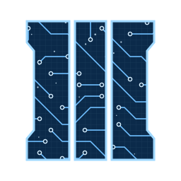
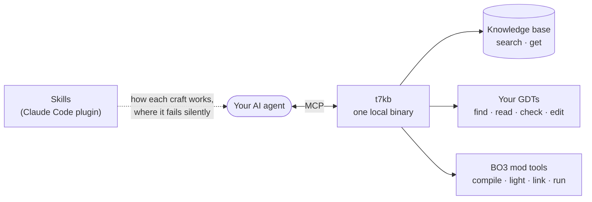

<div align="center">
    
    <h1>T7 Companion</h1>
    <h3><em>Black Ops 3 modding knowledge, grounded skills, and a headless build pipeline — for your AI agent.</em></h3>
</div>

<p align="center">
    <a href="https://github.com/McReaper/t7_companion/releases/latest"></a>
    <a href="LICENSE"></a>
    
    
</p>

<p align="center">
    <a href="#-install">Install</a> ·
    <a href="#-what-your-agent-gets">Features</a> ·
    <a href="#%EF%B8%8F-cli">CLI</a> ·
    <a href="#-updating">Updating</a> ·
    <a href="#-contributing">Contributing</a> ·
    <a href="#-license">License</a>
</p>

T7 Companion turns a general-purpose coding agent into a Black Ops 3 modding partner: a **local knowledge base** of the BO3 modding community, **skills** that know where each craft fails silently, and **tools** to check your GDTs and build your map without the Launcher. One binary, `t7kb`, served over MCP — everything runs offline on your machine.

> [!TIP]
> 🔊 Turn on audio for the demo.

https://github.com/user-attachments/assets/0d533897-fd35-4f0d-9774-948546c0af6b



## 📥 Install

### Claude Code

```
/plugin marketplace add McReaper/t7_companion
/plugin install t7kb@t7-reapy
/reload-plugins
/t7kb:setup
```

Pick the **User** scope when asked: a project-scope install doesn't load in subfolders such as `usermaps/<map>`.

`/t7kb:setup` downloads `t7kb` and its database, registers the MCP server, and offers to drop an `AGENTS.md` primer at your BO3 mod-tools root.

### Other MCP clients (Codex, OpenCode, Cursor, Copilot…)

```bash
curl -fsSL https://raw.githubusercontent.com/McReaper/t7_companion/main/install/install.sh | bash
```
```powershell
irm https://raw.githubusercontent.com/McReaper/t7_companion/main/install/install.ps1 | iex
```

Then register `t7kb mcp` as a stdio server ([per-client config](docs/clients.md)) and drop [`templates/AGENTS.md`](templates/AGENTS.md) at your BO3 mod-tools root — it carries the skills' core guidance for agents without them. Or paste this README to your agent and let it do all of that.

The database is a ~0.9 GB download that unpacks to ~3.5 GB on first run.

## ✨ What your agent gets

- **A knowledge base it searches before answering** — wikis, forums, Discord, Treyarch's scripts, tutorials and the mod-tools schemas. Every hit carries its source, URL and reliability, so the agent can cite it and weigh a Treyarch script above a Discord guess.
- **Skills for each craft** — scripting, mapping, compiling, assets, animation, zombies AI, HUD, FX, atmosphere and more: the method, and the traps that cost an afternoon (the callback that never fires, the wallbuy that shows *Cost: 0*). Claude Code only.
- **GDT tools** — find, read, check and edit APE's GDTs against the install's own schema, as a dry run unless told to write. `gdt_check` catches broken references, missing files and duplicates before the linker does.
- **A headless build** — compile, light, link and launch your map, with a short report and the first real error instead of hundreds of lines: *"Relink zm_mymap"*, *"Full compile of zm_mymap, then tell me what failed"*. Windows only.

## ⌨️ CLI

The same binary works from a terminal:

```
t7kb                         browse: type a query, pick a hit, read it
t7kb search <query>...       search  (--source api,wiki… · -n N · --bm25)
t7kb get <doc_id>            read a document  (--find · --offset · --all)
t7kb build <name>            compile/light/link/run  (--stages · --mod · --json)
t7kb gdt <command>           find | get | schema | edit | check | refs
t7kb mcp                     run the MCP server
t7kb update-check            is a newer release out? is the plugin behind?
```

## 🔄 Updating

`t7kb update-check` says whether the binary or the Claude Code plugin is behind, with the commands to update each. The plugin doesn't update itself unless you enable auto-update in `/plugin`. To refresh the binary, run `/t7kb:setup` in Claude Code, or re-run the installer with `--force` / `-Force`.

## 🤝 Contributing

Found a trap a skill doesn't mention, or one that's wrong? Tell your agent in Claude Code: the `contribute` skill writes the fix and, with your go-ahead, opens a pull request. By hand, start from [the authoring guide](plugin/skills/contribute/SKILL.md).

## 📄 License

> [!IMPORTANT]
> Code is **MIT** — see [`LICENSE`](LICENSE). `t7kb.db` bundles knowledge from the BO3 modding community; every entry carries its `source` and `url` for attribution — see [`docs/NOTICE.md`](docs/NOTICE.md).
